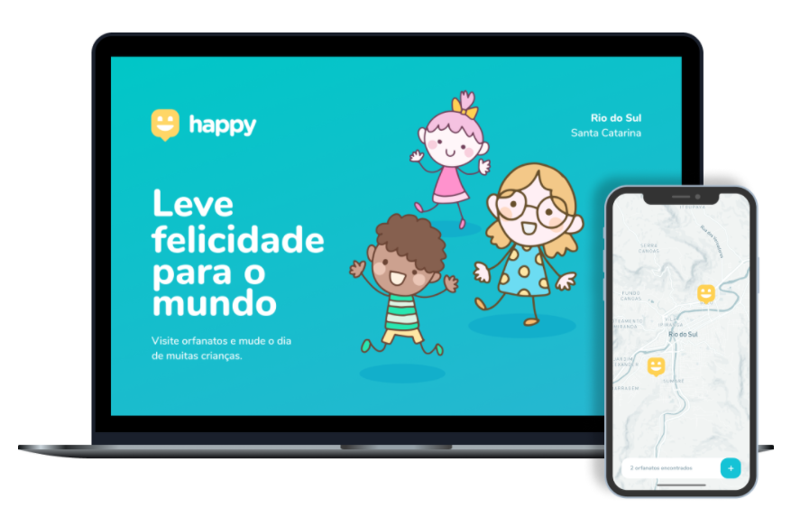

<h1 align="center">
    
</h1>

 

  

# Happy
 
Happy is an application that connects people to institutional care homes to make many children's day happier 💜

## Technologies

### Frontend

- JavaScript;
- Css3;
- HTML5;
- Nunjucks;

### Backend 

- Node.js;
- Express.js;
- Sqlite;

## 🔖 Layout

In the links below you will find the layout of the web and mobile project. Remembering that you need to have an account at [Figma] (http://figma.com/) to access it.

- [Layout Web](https://www.figma.com/file/mDEbnoojksG4w8sOxmudh3/Happy-Web)

------
Learning and Developing - by Felipe Fontoura - [See my linkedin!](https://www.linkedin.com/in/fontourafelipe/) 
 
